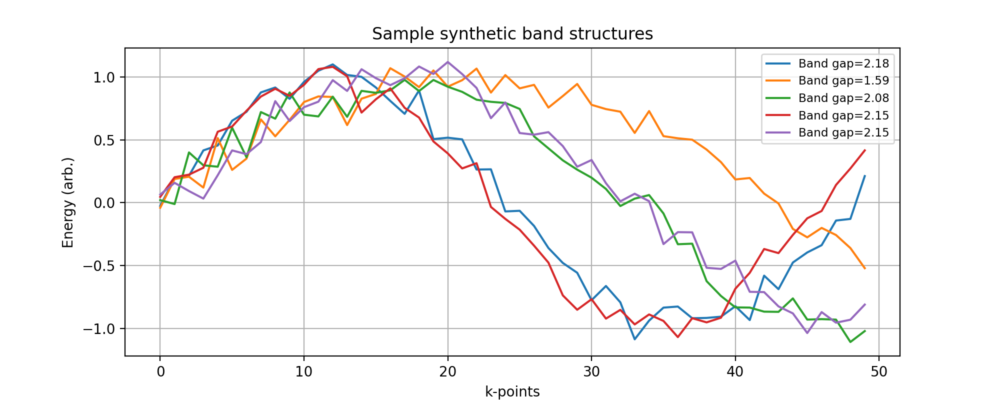
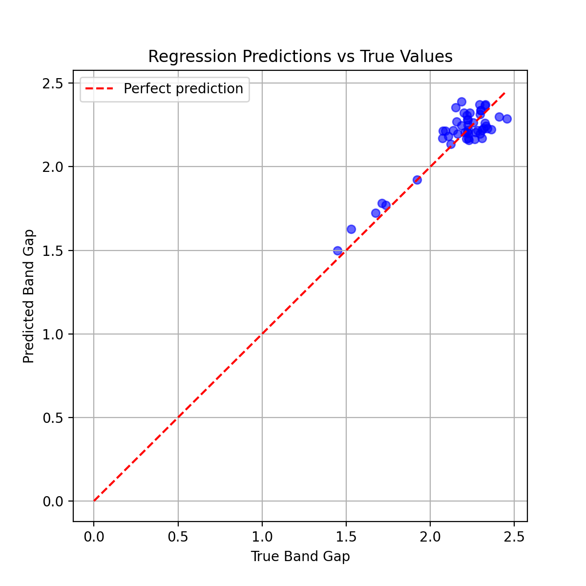

# Regression-Network-for-Material-Property-Prediction

## **Abstract**

**Abstract:**  
We present a Python‑based framework for predicting material band gaps from synthetic electronic band structure data using supervised regression with a feedforward neural network. The dataset is procedurally generated by simulating one‑dimensional band structures as noisy combinations of sine waves, with the band gap defined as the difference between the maximum and minimum energy values. This approach provides a controlled environment for testing regression models without requiring experimental or high‑throughput density functional theory (DFT) calculations.  

The neural network architecture consists of two hidden layers (64 and 32 neurons, ReLU activation) and a linear output layer for continuous band gap prediction. The model is trained using mean squared error (MSE) loss and the Adam optimizer, with performance evaluated on a held‑out test set. Visualization tools include:
- Sample synthetic band structures with annotated band gaps
- Model architecture diagrams
- Training and validation loss curves
- Scatter plots comparing predicted vs. true band gaps

## Features
- **Synthetic Data Generation**:
  - Band structures simulated as noisy sine wave combinations
  - Band gap defined as max–min energy difference
- **Regression Model**:
  - Two hidden layers (64 and 32 neurons, ReLU activation)
  - Linear output for continuous prediction
  - MSE loss, Adam optimizer
- **Visualization**:
  - Sample band structures with band gap labels
  - Model architecture diagram
  - Training/validation loss curves
  - Predicted vs. true band gap scatter plot
- **Automated Output Management**:
  - Plots and model summaries saved in organized folders

## Requirements
- Python 3.x
- NumPy
- Matplotlib
- TensorFlow / Keras

Install dependencies:

pip install numpy matplotlib tensorflow

## Usage
Run the script: Regression Network for Material Property Prediction.py

## Output Examples
- **`sample_band_structures.png`** — Example synthetic band structures with band gaps
- **`regression_model.png`** — Model architecture diagram
- **`training_loss.png`** — Training and validation loss curves
- **`predictions_vs_true.png`** — Scatter plot of predicted vs. true band gaps

## Customization
- `num_samples` — Number of training samples
- `num_kpoints` — Number of k‑points per band structure
- `epochs`, `batch_size` — Training parameters
- Network layer sizes and activations can be modified in the architecture section

## Potential Extensions
- Replace synthetic data with DFT‑calculated band structures
- Apply feature engineering (e.g., Fourier descriptors, statistical moments)
- Explore convolutional or graph neural networks for structured input
- Incorporate uncertainty quantification in predictions
## References
- Butler, K. T., Davies, D. W., Cartwright, H., Isayev, O., & Walsh, A. "Machine learning for molecular and materials science," *Nature*, 559, 547–555 (2018).
- Goodfellow, I., Bengio, Y., Courville, A. *Deep Learning*, MIT Press (2016).

## License
MIT License
